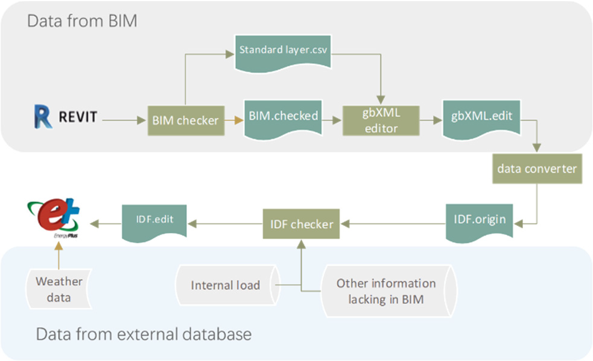

# BIM2BEM
This is the repository for paper: "Building energy modelling based on building information modelling: the remaining problems and a more robust method".

# Overview
The workflow of the tool is:



# Installation

The module is developed by `Revit API 2018` (C# version). As tested, it can be used for Revit 2019-2021.

It includes several modules, each module will have a single folder for the code.

# Cite this work

If you find this framework and tool is a help to your research, please consider to cite:

```
@inproceedings{bs2023_1412,
	doi = {https://doi.org/10.26868/25222708.2023.1412},
	url = {https://publications.ibpsa.org/conference/paper/?id=bs2023_1412},
	year = {2023},
	month = {September},
	publisher = {IBPSA},
	author = {Mingyue  Guo  and   Peng  Xu  and   Hongxin  Wang  and   Jiefan  Gu  and   Zhe  Chen},
	title  = {Building energy modelling based on building information modelling: the remaining problems and a more robust method},
	booktitle = {Proceedings of Building Simulation 2023: 18th Conference of IBPSA},
	volume  = {18},
	isbn = {},
	address  = {Shanghai, China},
	series  = {Building Simulation},
	pages = {1022--1030},
	issn = {2522-2708},
	Organisation = {IBPSA},
}
```


# Contact

Feel free to reach out to Mingyue Guo by mingyueeeeee@gmail.com
